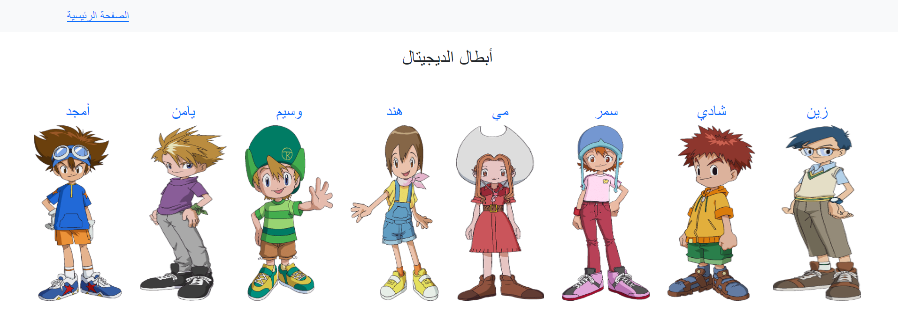
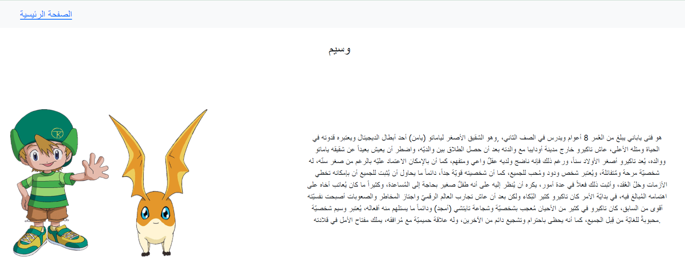

## W05D05 Lab 
### useParams
You can see this to understand more about useParams: 
* [CodeSandBox](https://xvmnr.csb.app/)

Make react app that will display characters and details for each one when click on it.
* In the component that you create switch on it for example the Nav component, make an array of object with your favorite characters, and pass it to the component you want to use it in.
* In Home component display the array of characters
* In character details component display more information about the character.

The output should be something like this with you favorite characters:

### useHistory
* [CodeSandBox](https://q85di.csb.app/)